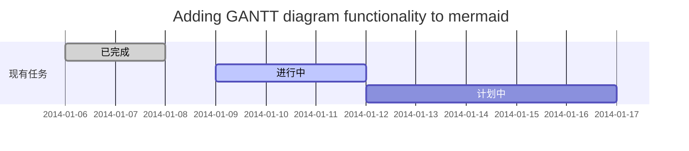
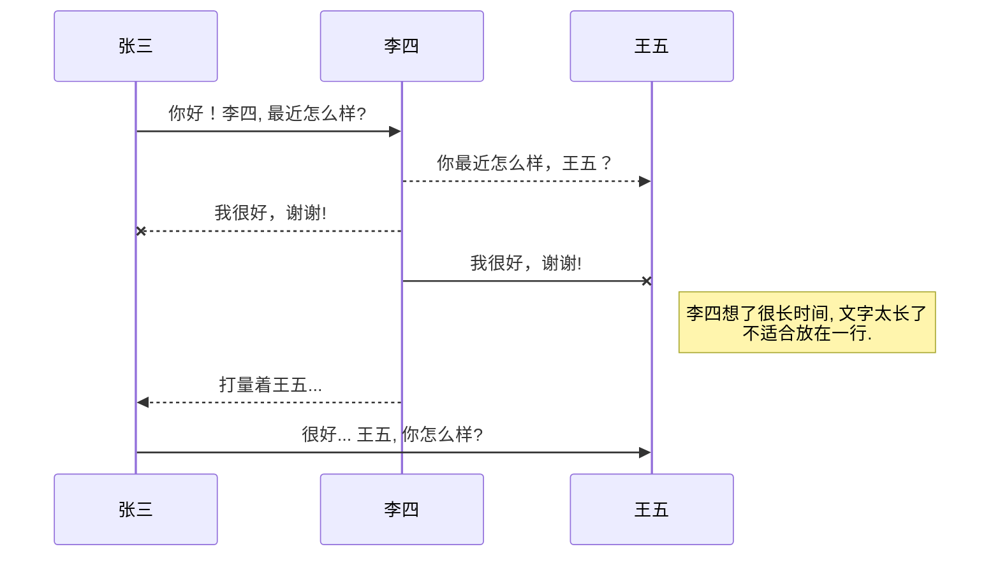
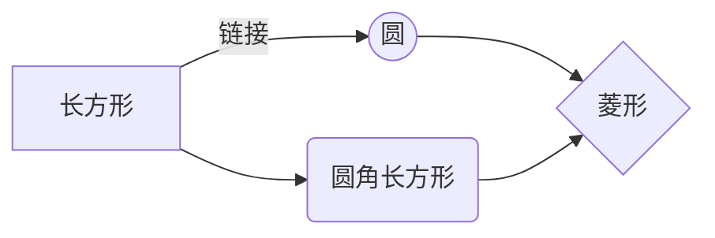

甘特图


插入UML图



插入Mermaid流程图

--------




插入Flowchart流程图


```mermaid

flowchart

st=>start: 开始

e=>end: 结束

op=>operation: 我的操作

cond=>condition: 确认？


st->op->cond

cond(yes)->e

cond(no)->op

```